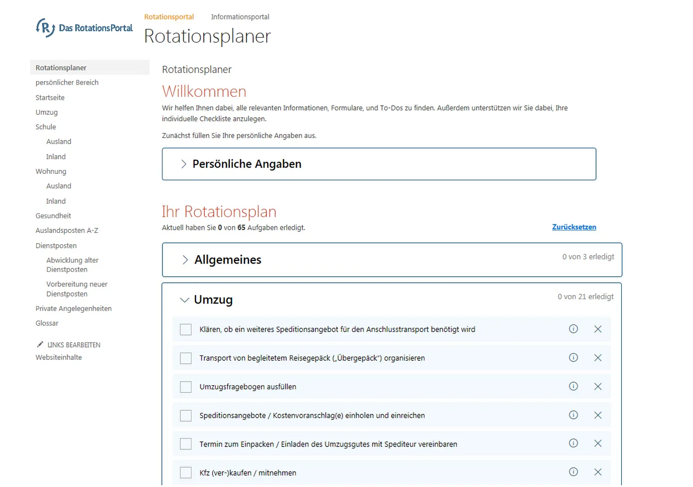
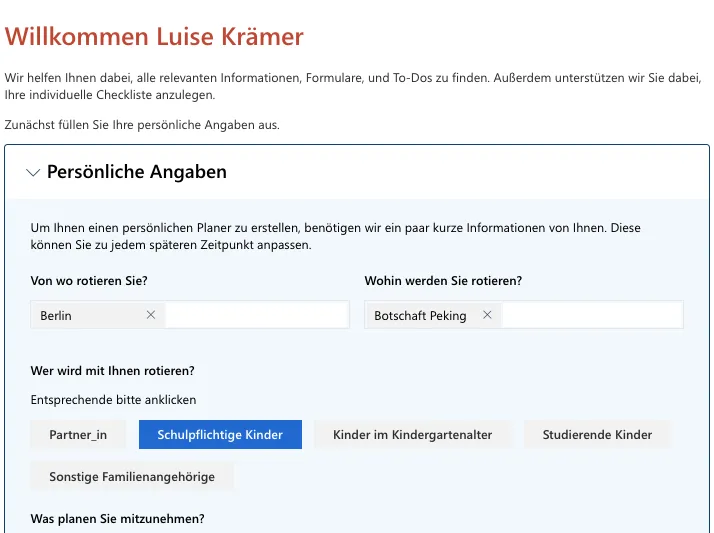
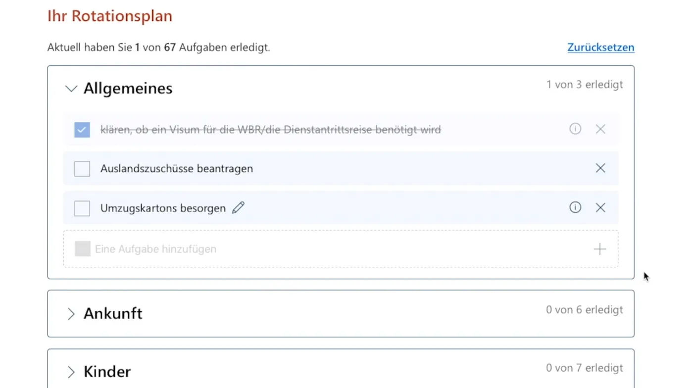
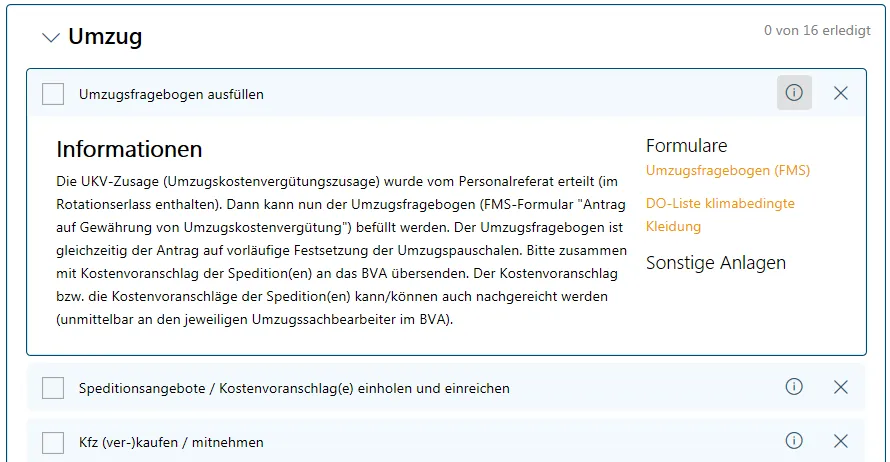

# Rotationsplaner

Der Rotationsplaner bildet zum ersten Mal den Prozess der Rotation ganzheitlich und zentral ab und bietet in einer personalisierten interaktiven Checkliste einen Überblick über alle relevanten Aufgaben, Informationen und Formulare im Rotationsprozess.



Dieses Projekt ist Teil von Tech4Germany 2019. Es entstand in Kollaboration mit dem Auswärtigen Amt.

## Grundlegende Funktionsweise



Um den Rotierenden nur die Informationen anzuzeigen, die für ihre aktuelle Situation relevant sind, gibt es die Möglichkeit der Personalisierung. In einem kurzen Fragebogen werden wichtige Faktoren angegeben, die ihre Rotation beeinflussen (wie z. B. Zielort oder die Rotation mit schulpflichtigen Kindern).

Um der Unübersichtlichkeit entgegenzuwirken, wurde ein personalisierter Rotationsplan entwickelt, der eine strukturierte Übersicht aller zu erfüllenden Aufgaben bietet. Diese sind übersichtlich nach Kategorien geordnet. Es gibt die Möglichkeit, zu jeder Kategorie eigene Aufgaben hinzuzufügen, und in der Checkliste zu speichern, welche Aufgaben bereits erledigt sind.



Die einzelnen Aufgaben sind mit weiteren Informationen, Formularen und Anlagen angereichert. Dadurch werden den Beschäftigten alle wichtigen Informationen zentral zur Verfügung gestellt.



## Technologien & Abhängikeiten

Microsoft Sharepoint ist eine web-basierte Plattform zum Erstellen und Verwalten von interaktiven Inhalten, zum Beispiel für Teams. Es wird im Intranet des Auswärtigen Amtes als Plattform für Wissensmanagement eingesetzt und bildet unter Anderem die Basis für das aktuelle Rotationsportal.

Sharepoint bietet mehrere Möglichkeiten, zusätzliche Funktionalitäten zu integrieren. Um den Integrationsaufwand möglichst gering zu halten, wurde in diesem Projekt ein Sharepoint Webpart erstellt. Diese benötigen keine zusätzliche Server Komponente, sondern kommunizieren mit der bestehenden Sharepoint Anwendung, wodurch der Implementierungs- und Maintenance-Aufwand niedrig gehalten wird. In Bezug auf die Darstellung der Inhalte hat man jedoch mehr Flexibilität als mit den Standard Sharepoint Komponenten.

Der Webpart wurde in Typescript (einer Variante von Javascript) implementiert und ist kompatibel mit allen gängigen Browsern (Chrome, Safari, Firefox, Internet Explorer 11). Die Benutzeroberfläche wurde mithilfe einer von Microsoft entwickelten Bibliothek implementiert, welche HTML-basierte UI Komponenten wie Buttons, Links und Dropdowns bereitstellt. Die Verwendung dieser Bibliothek ermöglicht eine leichte Integration in die Sharepoint-Umgebung und sorgt zusätzlich dafür, dass sich der Rotationsplaner visuell gut in die bestehenden Seiten einfügt. Der Webpart lädt die benötigten Daten bei jedem Aufruf mit Hilfe einer Microsoft-Bibliothek aus verschiedenen Sharepoint-Listen. Diese werden als Aufgaben in einzelnen Kategorien dargestellt. Die Darstellung wurde mittels CSS (SASS) angepasst (u.A. Farben, Rahmen und Abstände).

## Building

### Preconditions

- install git
- clone repository from
- nodejs v8.11.3
  - install from - https://nodejs.org/dist

### Building the code

```bash
git clone the repo
npm i
npm i -g gulp
gulp trust-dev-cert
NODE_NO_HTTP2=1 gulp serve
```

This package produces the following:

- lib/\* - intermediate-stage commonjs build artifacts
- dist/\* - the bundled script, along with other resources
- deploy/\* - all resources which should be uploaded to a CDN.

### Creating a deployment package

The following commands are taken from [this tutorial](http://www.sharepointsamples.com/deploy-sharepoint-framework-webpart-to-sharepoint-site/).

```bash
gulp clean
gulp build
gulp bundle --ship
gulp package-solution --ship
```

This will produce the following artifacts:

1. the `sharepoint/solution` folder with the .sppkg file to go to the App Catalog

2. The `temp/deploy` folder contains the artifacts to be deployed to the Site Asset Library (or CDN). In theory, they can be included in the .sppkg, but this didn't work when we tried it. Instead, the set the target destination in `config/write-manifests.json` and upload everything from `temp/deploy` to that destination (e.g. SharePoint SiteAssets).
   asd

### Exporting the site contents

In PowerShell, run the following (credentials for our hosted SharePoint can be found in Trello):

```
Connect-PnPOnline –Url https://rotationsportal.sp4.ovh.net -UseWebLogin
Get-PnPProvisioningTemplate -Out rotationsportal2019-09-30.xml -Handlers All -PersistBrandingFiles -PersistPublishingFiles –IncludeNativePublishingFiles
Add-PnPDataRowsToProvisioningTemplate -Path .\rotationsportal2019-09-30.xml -List 'Tasks' -Query '<view></view>'
```

Helpful resource: <https://medium.com/swlh/sharepoint-pnp-provisioning-with-data-move-your-contents-from-one-site-to-another-in-sharepoint-ed009f4a9e58>

## Weiterführende Links

- https://tech.4germany.org/project/rotationsportal/
- https://medium.com/tech4germany/fallstudie-rotationsportal-planungstool-zur-unterstützung-der-rotation-15d852f494b8
